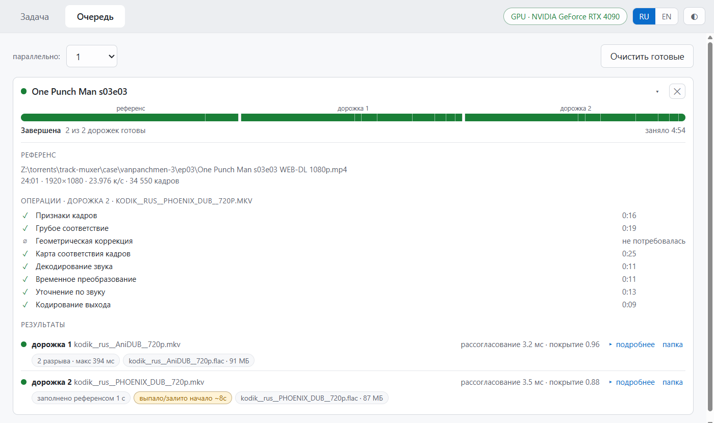
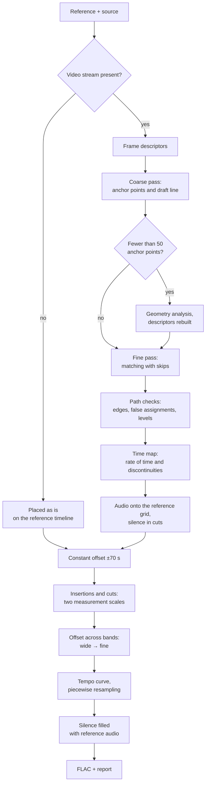
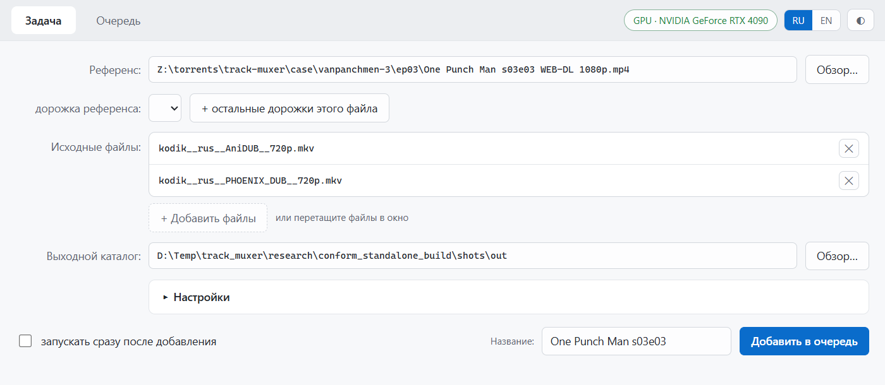
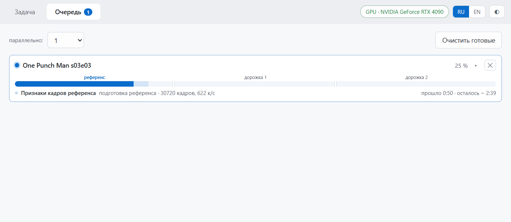
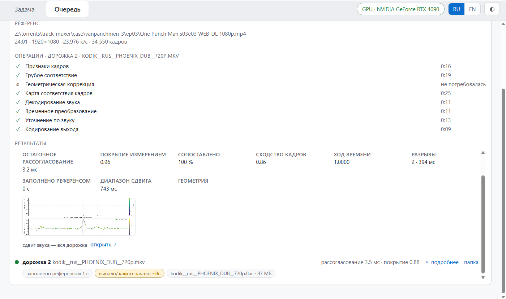

# conform-desktop

[Русский](README.md) · [Install](#installing-on-windows) · [Algorithms](#algorithms)

The application conforms an audio track to the timeline of a given video file: it finds cuts,
insertions and edit discontinuities, corrects tempo and removes the remaining offset.

| Mode | Input | What is measured |
|---|---|---|
| **Video + audio** | Reference and source are video files | The picture defines the structure; audio measurement works on top of it |
| **Audio only** | Source without a video stream (`flac`, `mka`, `mp3`, `aac`) | The audio pipeline resolves the whole discrepancy |

The output is FLAC on the reference timeline, with the source channel layout preserved
(2.0, 5.1, 7.1), plus a quality report with the measured values.

No mode has to be chosen for the material: measurements decide which corrections apply. The one
processing setting is the ceiling on how fast tempo correction may change at the audio level
(1.25 %/s by default, range 0.1–10).



A real job: a 24:01 1080p reference and two tracks from different studios, 4 min 54 s on an
RTX 4090. Residual offset 3.2 and 3.5 ms; the first track has 2 discontinuities (the largest
394 ms), the second a missing opening of about 8 s, flagged for review. (The interface is
shown in Russian; an English locale is available in the app.)

---

## Contents

- [What has to be recovered](#what-has-to-be-recovered)
- [Algorithms](#algorithms) · [Pipeline](#pipeline)
- [Level 1: picture](#level-1-picture) · [Level 2: audio](#level-2-audio)
- [Tempo](#tempo) · [Audio-only mode](#audio-only-mode)
- [Rejecting false decisions](#rejecting-false-decisions) · [Quality report](#quality-report)
- [Installing on Windows](#installing-on-windows) · [Running on Linux](#running-on-linux) · [Your first job](#your-first-job)
- [Repository](#repository) · [License](#license)

---

# What has to be recovered

The discrepancy between two editions of the same recording is not a constant but a function of
time with discontinuities. The classes of distortion handled here occur together in one file:

| Class | How it shows up | Range |
|---|---|---|
| Constant offset | The whole track is shifted against the picture | up to ±70 s |
| Insertion | The source contains material absent from the reference: a studio ident, an ad, an extra shot | unbounded |
| Cut | The source lacks a fragment of the reference | unbounded |
| Tempo change | PAL speed-up 25/24, slow-down 24/25, frame-rate conversion | taken from the data, no ceiling |
| Drift | Gradual divergence caused by different reference clocks | up to 1.25 %/s, adjustable (0.1–10) |
| 3:2 telecine | NTSC rip: 23.976 spread into 29.97, every fifth frame a blend of neighbours | inverse conversion |
| Geometry | Crop, zoom, anamorphic, different letterboxing | one transform per file |
| Variable frame rate | Frames are unevenly spaced, the frame number does not match time | time is taken from container timestamps |

**Why audio cannot be aligned against audio.** Different dubs have different voices, different
mixes and often their own music — there is no shared signal, and direct comparison produces
confident false matches. What the editions do share is the picture, so the picture defines the
structure. Audio measurement does not work on the waveform but on how energy changes across
frequency bands: what matches there is rhythm, not timbre.

---

# Algorithms

| Name | What it is | Where it is used |
|---|---|---|
| **SRM** (Spatial Rich Model) | A set of filters from steganalysis that extract micro-texture and ignore large detail | Frame descriptor immune to logos and subtitles |
| **DTW** (Dynamic Time Warping) | Matching two sequences with stretching along time | The basis of matching at both levels |
| **Drop-DTW** | DTW that can skip elements of either sequence | Insertions and cuts fall out by themselves; no separate boundary detector is needed |
| **Affine gap model** | Different cost for opening a gap and for extending it | A large cut drops out as a single piece |
| **Amercing DTW** | A penalty for every stretching step | Keeps the path from degenerating into a long plateau |
| **Banded DTW** | Computation only within a band around the expected line | Time and memory grow linearly with length, not quadratically |
| **LIS** | Longest non-decreasing subsequence | Keeps a monotonic chain of anchor points |
| **LoFTR** | A neural matcher that finds correspondences without a keypoint detector | Correspondences where classical methods fail on flat animation |
| **RANSAC** | Selecting a model by the number of agreeing observations | Frame transform under crop and zoom |
| **Theil — Sen** | A line estimate robust to outliers | The line between discontinuities |
| **TV-denoising** | Choosing levels across the whole track at once: a jump in level must pay for itself | Stable steps against measurement noise |
| **RDP** (Ramer — Douglas — Peucker) | Describing a curve with the fewest polyline vertices | A segment a straight line does not fit |
| **GCC-PHAT** | Phase-based comparison, indifferent to timbre | Diagnosing audio offset inside the source itself |
| **IVTC** | Inverse telecine | Removing the 3:2 cadence |
| **MuQ** | A learned model of music representation | Alternative audio map, not bundled with the distribution |

Offset is measured everywhere in frames of 23.976 — that is **41.7 ms**. A positive sign means
the source lags behind.

---

# Pipeline



---

# Level 1: picture

## 1.1. Frame descriptor — SRM

Pixel-by-pixel comparison is unusable: a channel logo, subtitles and different encoding make
identical frames look different. **SRM** is used — a set of filters from steganalysis, a field
where the task is to see the microstructure and not the picture itself.

The frame is converted to greyscale at 128×72 and passed through two SRM filters: one for sharp
transitions, one for the difference between neighbouring points. All of it serves the
micro-texture — grain and edges; brightness and contrast are brought to a common level. The
result is a vector of 18,432 values in float16.

The reasoning: overlaid graphics are large and smooth, so they barely enter the filter response,
while the texture of the scene remains. To the descriptor, a logo is transparent.

The match between two frames is a single number from 0 to 1.

Decoding runs without conversion to a constant frame rate: otherwise the decoder duplicates
frames and the numbering shifts. With a variable frame rate, frame time is taken from its
container timestamp.

## 1.2. Coarse pass

Every eighth frame is processed. A point becomes an anchor if the match with the best candidate
is above 0.60 **and** that candidate is clearly ahead of the runner-up.

The second condition matters more than the first. Dark, low-texture frames match dozens of
candidates equally well, and in animation "on twos" a single drawing is held for 2–3 frames —
the match is high but not unambiguous. Both cases are dropped for lack of separation.

From the anchors, **LIS** (longest non-decreasing subsequence) keeps a monotonic chain, and a
draft offset line is built along it. The start of the source is not pinned to anything: the
support is taken anywhere along the track, because the opening is often occupied by a foreign
ident.

The draft line immediately yields two quantities — the constant offset and the rate of time.
Jumps along the chain are candidates for edit events.

For long files there is a windowed variant of the pass: memory use does not depend on duration.

## 1.3. Fine pass

Comparing every frame against every frame is impossible by volume. The search runs in chunks of
4000 frames with an overlap of 700, within a band of ±120 frames (about 5 s) around the draft
line. At the seam the answer is taken from the chunk where the frame lies further from the edge;
the overlap is deliberately larger than the biggest expected edit, so an event falls entirely
inside the middle of at least one chunk.

Inside the band Drop-DTW works. It tracks frame correspondence and may skip a frame at any
point:

| Action | Meaning |
|---|---|
| Step in both | Running in sync |
| Step in one | One runs faster than the other |
| Skip a source frame | **Insertion** |
| Skip a reference frame | **Cut** |

A skip costs a penalty, so it happens only where there is genuinely nothing to match. Three
rules make the mechanism usable on real material:

- **Affine gap model** (as in DNA sequence comparison): opening a gap is expensive, extending it
  is almost free. With a flat per-frame cost, a long cut would be more expensive than stretching
  the path through foreign material, and the algorithm would choose distortion. With separate
  costs, a cut of any length drops out whole.
- **A frame with a good match may not be skipped.** Otherwise the gap creeps onto neighbouring,
  correctly matched frames.
- **The ends are free.** The path need not start and end in the corners: an ident and closing
  credits drop out without holding back the rest.

The boundaries of insertions and cuts are the edges of the gaps. There is no separate boundary
detector in the system.

## 1.4. Path checks

| What is checked | When it triggers | Action |
|---|---|---|
| Edges | More than a second was dropped at an edge | A repeat pass returns the matching opening or ending |
| Anchor density | At least three chain points nearby and the offset is consistent | The frame is protected from being dropped. Edges only: within the body dropping is necessary |
| False assignment | A zone longer than 3 s with a low match | The zone is removed: the frames are foreign, keeping them would stretch the audio |
| Offset level | The level changed by more than a second and holds | Distinguishes a real edit from a blind zone, restores gaps |
| Telecine | Rate 29–30.5 and a clear repetition with a period of 5 frames | **IVTC**: the redundant frame is removed from each group of five, the rate becomes 23.976 |

## 1.5. Geometry

The descriptor is tied to the position of a point in the frame, so under crop, zoom or different
letterboxing the match disappears entirely. The symptom: the coarse pass produced fewer than 50
anchor points.

Frames are then first synchronised by features that do not depend on geometry; on the pairs
found, **LoFTR** works — a neural matcher that finds correspondences without a keypoint detector
(classical detectors fail on flat animation). From its points the frame transform is estimated
with **RANSAC**, which selects the model by the number of agreeing observations. The result is
taken not from the best pair but from the agreement of many: the pair with the most matching
points may be misaligned in time.

The outcome is a crop region for each side. There is no rotation, so everything reduces to
cropping and scaling, performed by the decoder's own facilities. The descriptors are rebuilt and
the normal path continues.

## 1.6. Time map

From the matched frames a map "reference time → source time" is built on a half-second grid.

1. **The rate of time** is taken from the data with no ceiling: PAL speed-up or an arbitrary
   frame-rate conversion is used as it is. Only an outright impossible value is discarded — a
   sign that the anchor points are unusable.
2. **Discontinuities** are chosen with **TV-denoising** — across the whole track at once rather
   than by scanning left to right: a jump in level must pay for itself. A short excursion is
   absorbed, a stable step remains. A change from 8 frames (0.33 s) counts as a discontinuity.
   What decides is the behaviour of the level, not the length of the segment: if the offset left
   and came back, the segment is bridged, however many points fell into it.
3. **The line between discontinuities** is a **Theil — Sen** estimate, robust to outliers, with a
   slope ceiling of 0.45 frame/s. Where a straight line does not fit, the segment is described by
   a polyline (**RDP**). Points far from the line take no part in the fit.

A cut is defined as the interval between the anchor points of the neighbouring segments, not
computed from the size of the jump. Following the finished map, audio is resampled onto the
reference grid; in cuts, silence is placed with a 10 ms fade at the edges.

---

# Level 2: audio

The picture does not show what happened to the audio inside the source: a re-mix, a different
edition of the soundtrack, a splice of two sources. The second level works on the already
resampled stream and measures what is left.

## 2.1. Measurement across bands

Both tracks are converted to mono 16 kHz and split into 48 bands from 50 Hz to 14 kHz; in each
band a loudness envelope is taken.

What is compared is not the signals but the change of energy in the bands: different dubs have
different voices and mixes, but the rhythmic structure is shared. The offset at a point is the
agreed answer across all 48 bands, and how much the bands agree with each other is how much the
result can be trusted. A band where the reference carries the original vocal and the source does
not stays in the minority and does not determine the answer.

Measurement runs in two search ranges: a wide ±2.5 s and a fine ±0.7 s.

## 2.2. Constant offset

A track shifted as a whole beyond the search range will not be found by local measurement. A
separate procedure looks for a constant offset using 20 s windows at a 15 s step within
**±70 s**.

The value is accepted only under two conditions: it exceeds 2.5 s, that is, it is out of reach
for the main measurement, and more than 90 % of the windows agree with it. Otherwise the source
is left untouched — on sound material the procedure does nothing.

## 2.3. Insertions and cuts

Events absent from the picture, or beyond the measurement range, are found by a separate
Drop-DTW pass over the band envelopes. It runs in the **banded** variant — only within a band
around the expected line, so memory does not grow with duration — and is augmented with
**amercing**, a penalty for every stretching step: otherwise the path degenerates into a long
plateau instead of an honest gap.

A gap found is classified:

| Class | Criterion |
|---|---|
| Cut | A significant share of the reference is skipped in the interval, size from 3.34 s |
| Insertion | The interval carries twice as much source material, duration from 3.34 s |

The 3.34 s threshold applies to this pass only — it looks for large events outside the range of
the main measurement. Events up to 2.5 s are handled by the path in the next section, where the
threshold is 125 ms.

**Confirmation by two scales.** The pass runs twice: with a short 6 s window (sensitive) and a
long 18 s one (checking). An event is accepted only if it is visible in both and they agree in
time. The long window is computed lazily, once candidates appear.

Confirmed events are removed from the source as a step, after which measurement is repeated on
the corrected track.

## 2.4. Tracking the offset

1. **The wide pass** (±2.5 s) measures across the whole length.
2. From it a support trajectory is built and the source is pre-resampled.
3. **The fine pass** (±0.7 s) re-measures the residual on the resampled track. The full offset is
   the trajectory plus the residual. Replacing the re-measurement with statistics was tried: the
   discontinuity detector is tuned to the re-measured values, and the substitution makes results
   worse.
4. **Discontinuities.** The offset is split into segments of constant slope, minimum segment
   length 20 s. A stable change of level becomes a discontinuity; the threshold is 125 ms, below
   which measurement accuracy is comparable to the effect itself. A discontinuity survives only
   if the level after it differs stably from the level before, checked in separate windows on
   each side.
5. **The curve.** The level is computed only from reliable points; zones without support are not
   followed but bridged; the result is smoothed and limited in rate of change — 1.25 %/s by
   default, set in the interface.
6. **Resampling** runs in pieces between discontinuities: inside a piece the curve is smooth, at
   a discontinuity there is a step. Where material is missing, silence is placed for the size of
   the gap; where it is surplus, a narrow seam.

## 2.5. Filling silence

Sections where the source is silent (below −90 dB for longer than 0.15 s) while the reference
sounds are filled with reference audio — by this point it lies on the same grid. The joins are
crossfaded over 30 ms.

The order is mandatory: filling before alignment introduces a discrepancy of its own, because the
inserted material is synchronous while the receiving track is not yet.

## 2.6. Verification

The residual is measured independently — by a method that took no part in building the
correction.

Separately, using **GCC-PHAT** (phase-based comparison, indifferent to timbre), the offset of the
audio against the source's own picture is checked: a stable offset is flagged as a defect of the
source. The check runs before audio correction — afterwards the evidence is smeared by the edits
applied — and does not affect the result.

---

# Tempo

Tempo is corrected at both levels; it is a separate task for each.

| Level | What is built | Ceiling on rate of change |
|---|---|---|
| Picture | Rate of time from the data plus the line between discontinuities | 0.45 frame/s within a segment; the rate of time itself is unbounded. Constant |
| Audio | A curve over the segments between discontinuities | 1.25 %/s by default. Setting "Drift speed ceiling": 0.1–10 %/s, step 0.25 |

The curve is built from measurements across the whole length and follows them, so tempo is
corrected regardless of how it changed: constant speed-up, a slow slide, a different behaviour in
every segment. The slope of the curve is the ratio of tempos at that moment, and it moves with
the material.

What is limited is not the value of the slope but the speed at which it changes. The real rate of
time changes slowly, while rapid jumps of slope are a sign of measurement noise: by ear they
produce a wavering pitch. That is why the ceiling is exposed as a setting — material with a
strong tempo change is processed with the value raised.

---

# Audio-only mode

A source without a video stream goes through the same audio pipeline. The track is placed on the
reference timeline as it is (the tail beyond the reference length is cut off, a shortfall is
padded with silence), then in order: constant offset, insertions and cuts, offset tracking with
tempo correction, filling silence.

Tempo is corrected exactly as in the main mode: the curve is built from measurements across the
whole length and follows them. Report fields relating to the picture are not filled in this mode.

---

# Rejecting false decisions

A large part of the pipeline is not matching but rejection of plausible yet wrong decisions. Each
mechanism was added after a specific reproducible case.

| Source of error | What stands in the way |
|---|---|
| Low-texture frames resemble dozens of others | Separation between the best candidate and the runner-up is required |
| Repeated frames in animation | The same separation plus monotonicity of the chain |
| A gap creeps onto correctly matched frames | A frame with a good match may not be skipped |
| A synchronous but heavily re-encoded edge is dropped | Protection by anchor density — except where a real jump of offset is nearby |
| An insertion "sticks" to the neighbouring scene | A zone longer than 3 s with a low match is removed |
| A brief measurement failure taken for two edits | The offset left and came back — the segment is bridged |
| Noise turns into a staircase of discontinuities | Levels are chosen across the whole track at once: a jump must pay for itself |
| Jitter of anchor points taken for a tempo change | A robust line with a slope ceiling |
| Crop or zoom blinds the descriptor completely | Geometry analysis and rebuilt descriptors |
| Telecine cadence adds noise to measurement | Inverse conversion |
| A file from a different recording | Rejection when the share of matched frames falls below 60 %, before the heavy stages |
| Vocal asymmetry produces a false cut on music | Confirmation by band measurement, using only windows lying entirely inside the interval |
| A single false event | Confirmation by a second, longer window |
| The DTW path degenerates into a plateau | A penalty for stretching |
| Measurement in zones where the source is absent | Such intervals take no part in measurement |
| A false trigger on constant offset | A double criterion: size and agreement of windows |
| Audio shifted against the picture inside the source | Flagged as a defect of the source; no correction applied |

The general rule: **an uncertain measurement leads to no action rather than to an edit.** A blind
measurement does not confirm an event, an unconfirmed event is not applied, a point without
support takes no part in building the curve.

---

# Quality report

| Value | What it shows | Reference point |
|---|---|---|
| residual offset | Offset after processing, measured independently | single milliseconds; above ±80 ms it is flagged |
| measurement coverage | Share of the duration where audio measurement had support | below 50 % — the files share little audio |
| matched | Share of source frames that found a counterpart | below 60 % — processing stops |
| frame match | How close the matched frames are | low on heavily re-encoded material; not an error in itself |
| discontinuities | Number and size of the discontinuities found | insertions and cuts |
| rate of time | Ratio of tempos | should match the ratio of frame rates |
| filled from reference | How much was filled with reference audio | sections where the source has no material |

A failed track does not stop the job: the rest are processed and the reason is shown next to the
track it belongs to.

The plots in the job details show the source data of both levels: the measured offset, the
reliability of each point, the curve that was built, the discontinuities found and the filled
intervals.

**Performance:** a 23-minute 1080p reference with one track — 2 min 34 s on an RTX 4090. Without
CUDA the same pipeline runs on the CPU: slower, with an equivalent result.

---

# Installing on Windows

Requirements: Windows 10 or 11 (x64), 4.6 GB for the installation and about 8 GB for intermediate
files. Administrator rights are not needed.

### Step 1. Create a folder for the application

For example `D:\conform`. Everything is installed inside it; nothing is written to system
directories.

### Step 2. Download the launcher

From [Releases](../../releases) — `conform-setup.exe` (13 MB). Put it in that folder.

### Step 3. Run the launcher and press "Install"

A window lists the components. The launcher fetches them (about 1.5 GB), verifies checksums and
unpacks.

**Installing without network access.** The components can be obtained in advance by any means:

1. take `manifest.json` and the three `conform-*.7z` archives from the Releases page;
2. create a `packages` folder next to `conform-setup.exe` and put the files there;
3. run the launcher, press "Проверить наличие файлов" (check for files), then "Install".

Files are identified by checksum, so renaming during transfer does not matter.

### Step 4. Wait for the installation check

After unpacking, the launcher runs control material through the full pipeline and compares the
checksum of the result with the reference value. The log must show:

```
Результат обработки совпал с эталонным: установка исправна.
(the result matched the reference: the installation is sound)
```

What is verified is that it works, not that the files exist: incomplete unpacking and an
incompatible set of libraries are caught here.

### Step 5. Press "Run"

The application window opens. Afterwards you can start it either from the launcher or directly —
`app\conform-desktop.exe`.

### What the distribution contains

| Component | Contents | Archive |
|---|---|---|
| `conform-runtime` | Compute runtime: torch, CUDA libraries | 1199 MB |
| `conform-app` | Application, interface, processing core | 254 MB |
| `conform-ffmpeg` | Media decoder | 109 MB |

### Updating

Run the launcher of the new release **in the same folder**. It compares what is installed against
the release and fetches only what changed — usually `conform-app`.

---

# Running on Linux

There is no prebuilt Linux distribution — run from sources. Verified on Ubuntu 24.04 with CUDA.

### Step 1. System packages

```bash
sudo apt update
sudo apt install -y python3-venv python3-pip ffmpeg \
    libgl1 libegl1 libxkbcommon0 libxkbfile1 libxcb-cursor0 libnss3 libnspr4 \
    libasound2t64 libxdamage1 libxrandr2 libxcomposite1 libxtst6 libgbm1 \
    libcups2t64 libdrm2 libpango-1.0-0 libatk1.0-0t64 libatk-bridge2.0-0t64 \
    libatspi2.0-0t64 libgl1-mesa-dri
```

### Step 2. Python environment

```bash
git clone https://github.com/wolfram0108/conform-desktop.git
cd conform-desktop
python3 -m venv .venv
.venv/bin/pip install --upgrade pip
.venv/bin/pip install -r requirements.txt
```

Check that the GPU is visible:

```bash
.venv/bin/python -c "import torch; print(torch.cuda.is_available(), torch.cuda.get_device_name(0))"
```

`False` is not an error — processing will run on the CPU.

### Step 3. Run with a window

```bash
export PYTHONPATH="$PWD:$PWD/src"
export TM_FFMPEG=/usr/bin/ffmpeg TM_FFPROBE=/usr/bin/ffprobe
.venv/bin/python -m ui
```

### Step 4. Run without a graphical session

Over ssh, or on a machine without a display, no window can be created, but the application runs
as a local service with the interface opened in a browser:

```bash
export PYTHONPATH="$PWD:$PWD/src"
export TM_FFMPEG=/usr/bin/ffmpeg TM_FFPROBE=/usr/bin/ffprobe
export QT_QPA_PLATFORM=offscreen LIBGL_ALWAYS_SOFTWARE=1 GALLIUM_DRIVER=llvmpipe
export QTWEBENGINE_CHROMIUM_FLAGS='--no-sandbox --disable-gpu --single-process'
.venv/bin/python -m ui
```

Then open `http://127.0.0.1:8799/app/index.html`.

The variables are mandatory: without software OpenGL the embedded page engine aborts while
creating a graphics context. `--no-sandbox` is only needed when running as `root`.

---

# Your first job

1. **Task** tab, **Reference** field — the file that defines the timeline. If it has several
   audio tracks, select the one to serve as the audio reference.
2. **Source files** — add files with the button or by dragging them in, and mark the audio tracks
   to process for each. Files without a video stream are accepted.
3. **Output folder** — where to put the results.
4. **Add to queue**. With "start immediately" enabled processing begins at once; otherwise the
   job waits for the ▶ button.


5. **Queue** tab — progress. The bar is split into the reference and the tracks; below it are
   the current operation, elapsed time and the estimate remaining. The estimate is derived from
   the amount of work: frame counts and audio duration.



6. The arrow on the right expands the details: operations with their durations, a "not needed"
   mark on skipped ones, the measured values per track, and plots.



In the screenshot: 100 % of frames matched, frame similarity 0.86 (a heavily re-encoded source —
this does not affect the result), rate of time 1.0000 (the frame rates agree), two
discontinuities, offset span 743 ms, geometric correction not required.

---

# Repository

| Path | Contents |
|---|---|
| `src/track_muxer/conform/` | Processing core; synchronised from the canonical repository, see `docs/SYNC.md` |
| `server/` | Local HTTP API on top of the core |
| `ui/` | Qt interface, Russian and English |
| `build/` | Distribution build, see `build/README.md` |
| `installer/` | Thin launcher, splitting into components, control material, see `installer/README.md` |

Inside the core the computational part is separated from the plumbing:

```
conform/
├── kernel/            matching with skips, search band, coarse pass
├── features.py        frame descriptors, metadata probing
├── geom.py            geometry: crop, zoom, letterboxing
├── vision_detect.py   time map, telecine
├── anchor/            audio level: bands, event search, curve, resampling
├── align.py           the pipeline for one pair, both modes
└── episode.py         the whole job: the reference is decoded once
```

# License

GPL-3.0, see [LICENSE](LICENSE).

The MuQ model (`OpenMuQ/MuQ-large-msd-iter`) is optional and not bundled. When enabled, its
weights are downloaded from HuggingFace under CC-BY-NC 4.0 — that licence permits non-commercial
use of the results only.
