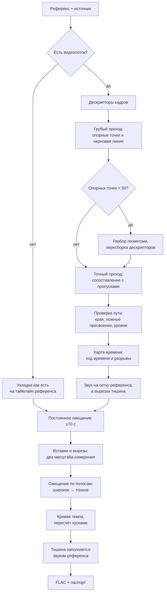

# conform-desktop

[English](README.en.md) · [Установка](#установка-на-windows) · [Алгоритм](#алгоритмы)

Приложение приводит звуковую дорожку к таймлайну заданного видеофайла: находит вырезы,
вставки и монтажные разрывы, выправляет темп, снимает остаточное смещение.

| Режим | Вход | Чем меряется |
|---|---|---|
| **Видео + звук** | Референс и источник — видеофайлы | Структуру задаёт видеоряд, поверх работает измерение по звуку |
| **Только звук** | Источник без видеопотока (`flac`, `mka`, `mp3`, `aac`) | Всё расхождение снимает звуковой конвейер |

Выход — FLAC на таймлайне референса, раскладка каналов источника сохраняется (2.0, 5.1, 7.1).
Рядом — паспорт качества с измеренными величинами.

Подбирать режим под материал не нужно: состав поправок определяют измерения. Единственная
настройка обработки — потолок скорости выправления темпа на звуковом уровне (по умолчанию
1.25 %/с, диапазон 0.1–10).


Снимок реальной задачи: референс 1080p 24:01 и две дорожки от разных студий, 4 мин 54 с на
RTX 4090. Остаточное рассогласование 3.2 и 3.5 мс, у первой дорожки найдено 2 разрыва
(наибольший 394 мс), у второй — выпавшее начало ~8 с, отмеченное для проверки.

---

## Оглавление

- [Что приходится восстанавливать](#что-приходится-восстанавливать)
- [Алгоритмы](#алгоритмы) · [Конвейер](#конвейер)
- [Уровень 1: видеоряд](#уровень-1-видеоряд) · [Уровень 2: звук](#уровень-2-звук)
- [Темп](#темп) · [Режим без видеоряда](#режим-без-видеоряда)
- [Отбраковка ложных решений](#отбраковка-ложных-решений) · [Паспорт качества](#паспорт-качества)
- [Установка на Windows](#установка-на-windows) · [Запуск на Linux](#запуск-на-linux) · [Первая задача](#первая-задача)
- [Репозиторий](#репозиторий) · [Лицензия](#лицензия)

---

# Что приходится восстанавливать

Расхождение двух изданий одной записи — не константа, а функция времени с разрывами. Классы
искажений, которые обрабатываются, встречаются одновременно в одном файле:

| Класс | Проявление | Охват |
|---|---|---|
| Постоянное смещение | Дорожка целиком сдвинута относительно видеоряда | до ±70 с |
| Вставка | В источнике есть фрагмент, которого нет в референсе: заставка, реклама, лишний план | не ограничена |
| Вырез | В источнике нет фрагмента референса | не ограничен |
| Изменение темпа | PAL-ускорение 25/24, замедление 24/25, пересчёт частоты кадров | снимается из данных, предела нет |
| Дрейф | Постепенное расхождение из-за разной опорной частоты | до 1.25 %/с, настраивается (0.1–10) |
| Телесин 3:2 | NTSC-рип: 23.976 разложены в 29.97, каждый пятый кадр — смесь соседних | обратное преобразование |
| Геометрия | Кроп, зум, анаморф, другие чёрные полосы | одно преобразование на файл |
| Переменная частота кадров | Кадры лежат неравномерно, номер кадра не соответствует времени | время берётся из меток контейнера |

**Почему нельзя выровнять звук по звуку.** У разных озвучек разные голоса, микс и часто своя
музыка — общего сигнала нет, прямое сравнение даёт устойчивые ложные совпадения. Общий у
изданий видеоряд, поэтому структуру задаёт он. Звуковое измерение работает не с формой волны,
а с тем, как меняется энергия по частотным полосам: там совпадает ритм, а не тембр.

---

# Алгоритмы

| Название | Что это | Где применён |
|---|---|---|
| **SRM** (Spatial Rich Model) | Набор фильтров из стеганализа, выделяющих микротекстуру и не реагирующих на крупные детали | Дескриптор кадра, устойчивый к логотипу и титрам |
| **DTW** (Dynamic Time Warping) | Поиск соответствия двух последовательностей с растяжением по времени | Основа сопоставления на обоих уровнях |
| **Drop-DTW** | DTW, который умеет пропускать элементы любой из последовательностей | Вставки и вырезы выпадают сами; отдельный детектор границ не нужен |
| **Аффинная модель разрыва** | Разная цена за открытие разрыва и за его продолжение | Крупный вырез выпадает одним куском |
| **Amercing DTW** | Штраф за каждый шаг растяжения | Не даёт пути выродиться в длинную полку |
| **Banded DTW** | Расчёт только в полосе вокруг ожидаемой линии | Время и память растут линейно с длиной, а не квадратично |
| **LIS** | Наибольшая неубывающая подпоследовательность | Из опорных точек оставляется монотонная цепочка |
| **LoFTR** | Нейросетевой матчер соответствий между кадрами, работающий без детектора особых точек | Соответствия там, где классические методы на плоской анимации не работают |
| **RANSAC** | Отбор модели по числу согласных наблюдений | Преобразование кадра при кропе и зуме |
| **Тейл — Сен** | Оценка прямой, устойчивая к выбросам | Линия между разрывами |
| **TV-denoising** | Выбор уровней сразу по всей дорожке: скачок уровня должен окупиться | Устойчивые ступени против шума измерения |
| **RDP** (Ramer — Douglas — Peucker) | Описание кривой ломаной с наименьшим числом изломов | Участок, на который прямая не ложится |
| **GCC-PHAT** | Сравнение по фазе, безразличное к тембру | Диагностика смещения звука внутри источника |
| **IVTC** | Обратное преобразование телесина | Снятие каденса 3:2 |
| **MuQ** | Обучаемая модель представления музыки | Альтернативная звуковая карта, в дистрибутив не входит |

Смещение везде измеряется в кадрах 23.976 — это **41.7 мс**. Знак «плюс» означает, что
источник отстаёт.

---

# Конвейер



---

# Уровень 1: видеоряд

## 1.1. Дескриптор кадра — SRM

Попиксельное сравнение непригодно: логотип, титры и разница кодирования делают одинаковые
кадры непохожими. Применяется **SRM** — набор фильтров из стеганализа, где нужно видеть
микроструктуру и не замечать саму картинку.

Кадр переводится в градации серого в разрешении 128×72 и проходит через два фильтра SRM: на
резкие перепады и на разницу между соседними точками. Всё ради микротекстуры — зерна и кромок; яркость
и контраст приводятся к единому уровню. Результат — вектор 18 432 значения float16.

Расчёт на то, что накладываемая графика крупная и гладкая: в отклик фильтров она не попадает,
текстура сцены остаётся. Логотип для дескриптора прозрачен.

Совпадение двух кадров — одно число от 0 до 1.

Декодирование идёт без приведения к постоянной частоте кадров: иначе декодер дублирует кадры и
нумерация уезжает. При переменной частоте время кадра берётся из его метки в контейнере.

## 1.2. Грубый проход

Обрабатывается каждый восьмой кадр. Точка становится опорной, если совпадение с лучшим
кандидатом выше 0.60 **и** лучший кандидат заметно оторвался от второго.

Второе условие важнее первого. Тёмные и малотекстурные кадры одинаково похожи на десятки
кандидатов, а в анимации на «двойках» один рисунок держится 2–3 кадра — совпадение высокое, но
однозначности нет. Оба случая отсеиваются по отсутствию отрыва.

Из опорных точек методом **LIS** (наибольшая неубывающая подпоследовательность) оставляется
монотонная цепочка, по ней строится черновая линия смещения.
Начало источника ничем не закрепляется: опора берётся в любом месте дорожки, потому что начало
часто занято чужой заставкой.

Черновая линия сразу даёт две величины — постоянное смещение и ход времени. Скачки вдоль
цепочки — кандидаты в монтажные события.

Для длинных файлов есть оконный вариант прохода: расход памяти не зависит от длительности.

## 1.3. Точный проход

Сверять все кадры со всеми невозможно по объёму. Поиск идёт кусками по 4000 кадров с
перекрытием 700, в полосе ±120 кадров (около 5 с) вокруг черновой линии. В шов берётся ответ
того куска, где кадр дальше от края; перекрытие заведомо больше самой крупной ожидаемой правки,
поэтому событие целиком попадает в середину хотя бы одного куска.

Внутри полосы работает Drop-DTW. Он ведёт соответствие кадров и в любой момент может кадр
пропустить:

| Действие | Что означает |
|---|---|
| Шаг по обоим | Идут синхронно |
| Шаг по одному | Один идёт быстрее другого |
| Пропуск кадра источника | **Вставка** |
| Пропуск кадра референса | **Вырез** |

Пропуск стоит штрафа, поэтому происходит только там, где сопоставлять действительно нечего.
Три правила делают механизм пригодным для реального материала:

- **Аффинная модель разрыва** (как в сравнении последовательностей ДНК): открыть разрыв дорого,
  продолжать — почти бесплатно. При одинаковой цене за каждый кадр
  длинный вырез обходился бы дороже, чем растянуть путь через чужой материал, и алгоритм
  выбирал бы искажение. С раздельной ценой вырез любой длины выпадает целиком.
- **Кадру с хорошим соответствием пропуск запрещён.** Иначе разрыв расползается на соседние
  правильно сопоставленные кадры.
- **Концы свободны.** Путь не обязан начинаться и кончаться в углах: заставка и титры выпадают,
  не удерживая остальное.

Границы вставок и вырезов — это края разрывов. Отдельного детектора границ в системе нет.

## 1.4. Проверка пути

| Что проверяется | Когда срабатывает | Действие |
|---|---|---|
| Края | На краю выброшено больше секунды | Повторный проход возвращает совпадающее вступление или концовку |
| Плотность опорных точек | Рядом не меньше трёх точек цепочки и смещение согласовано | Кадр защищён от выброса. Только на краях: в теле дорожки выброс необходим |
| Ложное присвоение | Зона длиннее 3 с при низком совпадении | Зона снимается: кадры чужие, их удержание растянуло бы звук |
| Уровень смещения | Уровень изменился больше чем на секунду и держится | Отличает реальную правку от слепой зоны, восстанавливает пропуски |
| Телесин | Частота 29–30.5 и заметный повтор с периодом 5 кадров | **IVTC**: из каждой пятёрки убирается лишний кадр, частота приводится к 23.976 |

## 1.5. Геометрия

Дескриптор привязан к положению точки в кадре, поэтому при кропе, зуме или других чёрных
полосах совпадение пропадает полностью. Признак — грубый проход дал меньше 50 опорных точек.

Тогда кадры сначала синхронизируются по признакам, не зависящим от геометрии, затем на
найденных парах работает **LoFTR** — нейросетевой матчер, находящий соответствия без детектора
особых точек (классические детекторы на плоской анимации не работают). По его точкам
преобразование кадра оценивается методом **RANSAC**, который отбирает модель по числу согласных
наблюдений. Итог берётся не по лучшей паре, а по согласию многих: пара с наибольшим числом
совпадающих точек может быть смещена по времени.

Результат — области кадрирования для обеих сторон. Поворота нет, поэтому всё сводится к
кадрированию и масштабированию, то есть выполняется штатными средствами декодера. Дескрипторы
пересобираются, дальше идёт обычный путь.

## 1.6. Карта времени

Из сопоставленных кадров строится карта «время референса → время источника», шаг сетки
полсекунды.

1. **Ход времени** снимается из данных, потолка нет: ускорение PAL или произвольный пересчёт
   частоты берутся как есть. Отбрасывается только заведомо невозможное значение — признак, что
   опорные точки непригодны.
2. **Разрывы** выбираются методом **TV-denoising** — сразу по всей дорожке, а не просмотром
   слева направо: скачок уровня должен окупиться. Короткий выброс поглощается, устойчивая
   ступень остаётся. Разрывом считается изменение от 8 кадров (0.33 с). Решает поведение
   уровня, а не длина участка: если смещение ушло и вернулось, участок сшивается, сколько бы
   точек в него ни попало.
3. **Линия между разрывами** — оценка **Тейла — Сена**, устойчивая к выбросам, с потолком
   наклона 0.45 кадра/с. Если прямая не ложится, участок описывается ломаной (**RDP**). Точки,
   далеко отстоящие от линии, в подгонке не участвуют.

Вырез задаётся промежутком между опорными точками соседних участков, а не вычисляется из
величины скачка. По готовой карте звук пересчитывается на сетку референса; в вырезах ставится
тишина с затуханием 10 мс по краям.

---

# Уровень 2: звук

Видеоряд не показывает, что случилось со звуком внутри источника: пересведение, другая
редакция фонограммы, склейка из двух источников. Второй уровень работает на уже пересчитанном
потоке и меряет остаток.

## 2.1. Измерение по полосам

Обе дорожки приводятся к моно 16 кГц и раскладываются на 48 полос от 50 Гц до 14 кГц; в каждой
полосе берётся огибающая громкости.

Сравниваются не сигналы, а изменение энергии в полосах: у разных озвучек разные голоса и микс,
но ритмическая структура общая. Смещение в точке — согласованный ответ по всем 48 полосам, а
насколько полосы согласны между собой, настолько результату можно верить. Полоса, где у
референса звучит оригинальный вокал, а у источника нет, остаётся в меньшинстве и ответ не
определяет.

Измерение ведётся в двух диапазонах поиска: широком ±2.5 с и тонком ±0.7 с.

## 2.2. Постоянное смещение

Дорожку, съехавшую целиком дальше диапазона поиска, локальное измерение не найдёт. Отдельная
процедура ищет постоянное смещение окнами 20 с с шагом 15 с в диапазоне **±70 с**.

Величина принимается только при двух условиях: она больше 2.5 с, то есть недостижима для
основного измерения, и с ней согласны больше 90 % окон. Иначе источник не трогается — на
исправном материале процедура ничего не делает.

## 2.3. Вставки и вырезы

События, которых нет на видеоряде или которые выходят за диапазон измерения, ищет отдельный
проход на Drop-DTW по полосным огибающим. Он выполняется в варианте **banded** — только в полосе
вокруг ожидаемой линии, поэтому память не растёт с длительностью, — и дополнен **amercing**,
штрафом за каждый шаг растяжения: иначе путь вырождается в длинную полку вместо честного
разрыва.

Найденный разрыв классифицируется:

| Класс | Признак |
|---|---|
| Вырез | В интервале пропущена заметная доля референса, величина от 3.34 с |
| Вставка | На интервал приходится вдвое больше материала источника, длительность от 3.34 с |

Порог 3.34 с относится только к этому проходу — он ищет крупные события вне диапазона
основного измерения. События до 2.5 с обрабатывает путь из следующего пункта, порог там 125 мс.

**Подтверждение двумя масштабами.** Проход выполняется дважды: с коротким окном 6 с
(чувствительным) и длинным 18 с (проверяющим). Событие принимается, только если видно в обоих,
и они сходятся по времени. Длинное окно считается лениво, при появлении кандидатов.

Подтверждённые события снимаются с источника ступенькой, после чего измерение повторяется на
исправленной дорожке.

## 2.4. Ведение смещения

1. **Широкий проход** (±2.5 с) даёт измерение по всей длине.
2. По нему строится опорная траектория, источник предварительно пересчитывается.
3. **Тонкий проход** (±0.7 с) переизмеряет остаток на пересчитанной дорожке. Полное смещение —
   сумма траектории и остатка. Заменить переизмерение статистикой пробовали: детектор разрывов
   согласован именно с переизмеренными величинами, замена ухудшает результат.
4. **Разрывы.** Смещение разбивается на участки постоянного наклона, минимальная длина участка
   20 с. Устойчивое изменение уровня становится разрывом; порог — 125 мс, ниже точность
   измерения сопоставима с самой величиной. Разрыв остаётся, только если уровень после него
   устойчиво отличается от уровня до, что проверяется по отдельным окнам справа и слева.
5. **Кривая.** Уровень считается только по надёжным точкам, зоны без опоры не отслеживаются, а
   мостятся; результат сглаживается и ограничивается по скорости изменения — 1.25 %/с по
   умолчанию, задаётся в интерфейсе.
6. **Пересчёт** идёт кусками между разрывами: внутри куска кривая гладкая, на разрыве — скачок.
   Где материала не хватает, ставится тишина по величине разрыва; где он лишний — узкий шов.

## 2.5. Заполнение тишины

Участки, где источник молчит (тише −90 дБ дольше 0.15 с), а референс звучит, заполняются звуком
референса — он к этому моменту лежит на той же сетке. Стыки сшиваются переходом 30 мс.

Порядок обязателен: заполнение до выравнивания само вносит расхождение, потому что
подставляемый материал синхронен, а принимающая дорожка ещё нет.

## 2.6. Контроль

Остаток меряется независимо — методом, который не участвовал в построении коррекции.

Отдельно, методом **GCC-PHAT** (сравнение по фазе, безразличное к тембру), проверяется смещение
звука относительно собственного видеоряда источника: устойчивое смещение помечается как дефект
исходника. Проверка идёт до звуковой коррекции — после неё
признак размывается внесёнными правками — и на результат не влияет.

---

# Темп

Темп выправляется на обоих уровнях, это отдельная задача каждого.

| Уровень | Что строится | Потолок скорости изменения |
|---|---|---|
| Видеоряд | Ход времени из данных плюс линия между разрывами | 0.45 кадра/с внутри участка; сам ход времени не ограничен. Константа |
| Звук | Кривая по участкам между разрывами | 1.25 %/с по умолчанию. Настройка «Потолок скорости дрейфа»: 0.1–10 %/с, шаг 0.25 |

Кривая строится по измерениям на всей длине и следует за ними, поэтому темп выправляется
независимо от того, как он менялся: постоянное ускорение, плавный уход, изменение на каждом
участке по-своему. Наклон кривой — это отношение темпов в данный момент, и он меняется вместе
с материалом.

Ограничена не величина наклона, а скорость его изменения. Реальный ход времени меняется
медленно, а быстрые скачки наклона — признак шума измерения: на слух они дают «плавающий» тон.
Поэтому потолок и вынесен в настройку — материал с сильным изменением темпа обрабатывается при
поднятом значении.

---

# Режим без видеоряда

Источник без видеопотока проходит тот же звуковой конвейер. Дорожка кладётся на таймлайн
референса как есть (хвост за длиной референса отсекается, нехватка дополняется тишиной), дальше
по порядку: постоянное смещение, вставки и вырезы, ведение смещения с выправлением темпа,
заполнение тишины.

Темп выправляется так же, как и в основном режиме: кривая строится по измерениям на всей длине
и следует за ними. Поля паспорта, относящиеся к видеоряду, в этом режиме не заполняются.

---

# Отбраковка ложных решений

Значительная часть конвейера — не сопоставление, а отбраковка правдоподобных, но неверных
решений. Каждый механизм добавлен по конкретному воспроизводимому случаю.

| Источник ошибки | Что стоит на пути |
|---|---|
| Малотекстурные кадры похожи на десятки других | Требуется отрыв лучшего кандидата от второго |
| Повторяющиеся кадры анимации | Тот же отрыв плюс монотонность цепочки |
| Разрыв расползается на правильно сопоставленные кадры | Кадру с хорошим соответствием пропуск запрещён |
| Синхронный, но сильно пережатый край выбрасывается | Защита по плотности опорных точек — кроме мест, где рядом реальный скачок смещения |
| Вставка «налипает» на соседнюю сцену | Зона длиннее 3 с с низким совпадением снимается |
| Кратковременный сбой измерения принят за две правки | Смещение ушло и вернулось — участок сшивается |
| Шум превращается в лестницу разрывов | Уровни выбираются сразу по всей дорожке: скачок должен окупиться |
| Дрожание опорных точек принято за изменение темпа | Устойчивая прямая с потолком наклона |
| Кроп или зум ослепляют дескриптор целиком | Разбор геометрии и пересборка дескрипторов |
| Каденс телесина шумит в измерении | Обратное преобразование |
| Файл от другой записи | Отсечка при доле сопоставленных кадров ниже 60 %, до тяжёлых этапов |
| Асимметрия вокала даёт ложный вырез на музыке | Подтверждение полосным измерением, только по окнам целиком внутри интервала |
| Одиночное ложное событие | Подтверждение вторым, более длинным окном |
| Путь DTW вырождается в полку | Штраф за растяжение |
| Измерение в зонах, где источника нет | Такие интервалы в измерении не участвуют |
| Ложное срабатывание на постоянном смещении | Двойной критерий: величина и согласие окон |
| Звук съехал относительно видеоряда внутри источника | Помечается как дефект исходника, коррекция не применяется |

Общее правило: **неуверенное измерение приводит к бездействию, а не к правке**. Слепое
измерение не подтверждает событие, неподтверждённое событие не применяется, точка без опоры не
участвует в построении кривой.

---

# Паспорт качества

| Величина | Что показывает | Ориентир |
|---|---|---|
| остаточное рассогласование | Смещение после обработки, измеренное независимо | единицы миллисекунд; выше ±80 мс отмечается |
| покрытие измерением | Доля длительности, где у звукового измерения была опора | ниже 50 % — у файлов мало общего звука |
| сопоставлено | Доля кадров источника, нашедших пару | ниже 60 % — обработка прекращается |
| совпадение кадров | Насколько похожи сопоставленные кадры | низкое при сильном пережатии; само по себе не ошибка |
| разрывы | Число и величина найденных разрывов | вставки и вырезы |
| ход времени | Отношение темпов | должно совпадать с отношением частот кадров |
| заполнено референсом | Сколько заполнено звуком референса | участки, где у источника материала нет |

Отказ одной дорожки не останавливает задачу: остальные обрабатываются, причина указывается при
своей дорожке.

Графики в подробностях задачи показывают исходные данные обоих уровней: измеренное смещение,
надёжность по точкам, построенную кривую, найденные разрывы и заполненные интервалы.

**Производительность:** референс 1080p длительностью 23 минуты и одна дорожка — 2 мин 34 с на
RTX 4090. Без CUDA выполняется тот же конвейер на процессоре: медленнее, результат
эквивалентен.

---

# Установка на Windows

Требования: Windows 10 или 11 (x64), 4.6 ГБ под установку и около 8 ГБ под промежуточные файлы.
Права администратора не нужны.

### Шаг 1. Создайте папку для приложения

Например `D:\conform`. Установка развернётся внутри неё, в системные каталоги ничего не пишется.

### Шаг 2. Скачайте загрузчик

Со страницы [Releases](../../releases) — файл `conform-setup.exe` (13 МБ). Поместите его в
созданную папку.

### Шаг 3. Запустите загрузчик и нажмите «Установить»

Откроется окно со списком компонентов. Загрузчик получит их (около 1.5 ГБ), сверит контрольные
суммы и распакует.

**Установка без доступа к сети.** Компоненты можно получить заранее любым способом:

1. со страницы Releases возьмите `manifest.json` и три архива `conform-*.7z`;
2. создайте рядом с `conform-setup.exe` каталог `packages` и поместите файлы туда;
3. запустите загрузчик, нажмите «Проверить наличие файлов», затем «Установить».

Файлы опознаются по контрольной сумме, поэтому переименование при передаче значения не имеет.

### Шаг 4. Дождитесь проверки установки

После распаковки загрузчик прогоняет контрольный материал через полный конвейер и сверяет
контрольную сумму результата с эталонной. В журнале должно появиться:

```
Результат обработки совпал с эталонным: установка исправна.
```

Проверяется работоспособность, а не наличие файлов: неполная распаковка и несовместимый набор
библиотек выявляются именно здесь.

### Шаг 5. Нажмите «Запустить»

Откроется окно приложения. Дальше запускать можно и загрузчиком, и напрямую —
`app\conform-desktop.exe`.

### Состав дистрибутива

| Компонент | Что внутри | Архив |
|---|---|---|
| `conform-runtime` | Вычислительный рантайм: torch, библиотеки CUDA | 1199 МБ |
| `conform-app` | Приложение, интерфейс, ядро обработки | 254 МБ |
| `conform-ffmpeg` | Декодер медиафайлов | 109 МБ |

### Обновление

Запустите загрузчик нового выпуска **в той же папке**. Он сверит установленное с составом
выпуска и получит только изменившееся — как правило, `conform-app`.

---

# Запуск на Linux

Готового дистрибутива для Linux нет — запуск из исходных текстов. Проверено на Ubuntu 24.04
с CUDA.

### Шаг 1. Системные пакеты

```bash
sudo apt update
sudo apt install -y python3-venv python3-pip ffmpeg \
    libgl1 libegl1 libxkbcommon0 libxkbfile1 libxcb-cursor0 libnss3 libnspr4 \
    libasound2t64 libxdamage1 libxrandr2 libxcomposite1 libxtst6 libgbm1 \
    libcups2t64 libdrm2 libpango-1.0-0 libatk1.0-0t64 libatk-bridge2.0-0t64 \
    libatspi2.0-0t64 libgl1-mesa-dri
```

### Шаг 2. Окружение Python

```bash
git clone https://github.com/wolfram0108/conform-desktop.git
cd conform-desktop
python3 -m venv .venv
.venv/bin/pip install --upgrade pip
.venv/bin/pip install -r requirements.txt
```

Проверка, что видеокарта доступна:

```bash
.venv/bin/python -c "import torch; print(torch.cuda.is_available(), torch.cuda.get_device_name(0))"
```

Ответ `False` не ошибка — обработка пойдёт на процессоре.

### Шаг 3. Запуск с окном

```bash
export PYTHONPATH="$PWD:$PWD/src"
export TM_FFMPEG=/usr/bin/ffmpeg TM_FFPROBE=/usr/bin/ffprobe
.venv/bin/python -m ui
```

### Шаг 4. Запуск без графической сессии

По ssh или на машине без дисплея окно не создаётся, но приложение работает как локальный
сервис, интерфейс открывается браузером:

```bash
export PYTHONPATH="$PWD:$PWD/src"
export TM_FFMPEG=/usr/bin/ffmpeg TM_FFPROBE=/usr/bin/ffprobe
export QT_QPA_PLATFORM=offscreen LIBGL_ALWAYS_SOFTWARE=1 GALLIUM_DRIVER=llvmpipe
export QTWEBENGINE_CHROMIUM_FLAGS='--no-sandbox --disable-gpu --single-process'
.venv/bin/python -m ui
```

Затем откройте `http://127.0.0.1:8799/app/index.html`.

Переменные обязательны: без программного OpenGL встроенный движок страницы завершает работу при
создании графического контекста. Флаг `--no-sandbox` нужен только при запуске от `root`.

---

# Первая задача

1. Вкладка **Задача**, поле **Референс** — файл, задающий таймлайн. Если аудиодорожек
   несколько, укажите ту, что служит звуковым эталоном.
2. **Исходные файлы** — добавьте файлы кнопкой или перетаскиванием, для каждого отметьте
   обрабатываемые аудиодорожки. Файлы без видеопотока принимаются.
3. **Выходной каталог** — куда складывать результат.
4. **Добавить в очередь**. При включённом «запускать сразу» обработка начнётся немедленно,
   иначе задача ждёт кнопки ▶.


5. Вкладка **Очередь** — ход выполнения. Полоса разбита на референс и дорожки; под ней —
   текущая операция, затраченное время и прогноз оставшегося. Прогноз считается по объёму
   работы: числу кадров, длительности звука.


6. Стрелка справа раскрывает подробности: операции с длительностью, отметка «не потребовалась»
   у пропущенных, измеренные величины по каждой дорожке и графики.


На снимке: сопоставлено 100 % кадров, сходство 0.86 (источник сильно пережат — на результат не
влияет), ход времени 1.0000 (частоты кадров совпадают), два разрыва, диапазон сдвига 743 мс,
геометрическая коррекция не понадобилась.

---

# Репозиторий

| Путь | Содержимое |
|---|---|
| `src/track_muxer/conform/` | Ядро обработки; синхронизируется из канонического репозитория, порядок — `docs/SYNC.md` |
| `server/` | Локальный HTTP API поверх ядра |
| `ui/` | Интерфейс на Qt, русский и английский |
| `build/` | Сборка дистрибутива, см. `build/README.md` |
| `installer/` | Тонкий загрузчик, нарезка на компоненты, контрольный материал, см. `installer/README.md` |

Внутри ядра расчётная часть отделена от обвязки:

```
conform/
├── kernel/            сопоставление с пропусками, полоса поиска, грубый проход
├── features.py        дескрипторы кадров, разбор метаданных
├── geom.py            геометрия: кроп, зум, полосы
├── vision_detect.py   карта времени, телесин
├── anchor/            звуковой уровень: полосы, поиск событий, кривая, пересчёт
├── align.py           конвейер одной пары, оба режима
└── episode.py         задача целиком: референс декодируется один раз
```

# Лицензия

GPL-3.0, см. [LICENSE](LICENSE).

Модель MuQ (`OpenMuQ/MuQ-large-msd-iter`) необязательна и в дистрибутив не входит. При её
включении веса загружаются с HuggingFace по лицензии CC-BY-NC 4.0 — она допускает только
некоммерческое использование результата.
